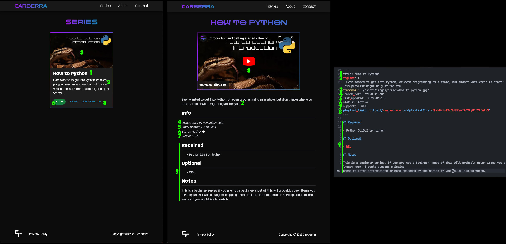

# Carberra Tutorials Website

The repo for the Carberra Tutorials website.

## Table of Contents

- [Tech Stack](#tech-stack)
  - [Overview](#overview)
  - [Packages](#packages)
  - [Helpers](#helpers)
  - [Storybook Addons](#storybook-addons)
  - [Markdown Plugins](#markdown-plugins)
- [Structure](#structure)
  - [Source Structure](#source-structure)
  - [Public Structure](#public-structure)
- [Branches](#branches)
- [Development](#development)
  - [Running Storybook](#running-storybook)
- [Production](#production)
  - [Running Next JS](#running-next-js)
  - [Running Next JS (Automatically)](#running-next-js-automatically)
  - [Running Plausible](#running-plausible)
    - [First Time Only](#first-time-only)
    - [Every Time](#every-time)
- [Adding a New Series](#adding-a-new-series)
  - [Creating the Markdown File](#creating-the-markdown-file)
  - [Adding the Metadata](#adding-the-metadata)
  - [Adding Extra Information](#adding-extra-information)
  - [Adding the Thumbnail](#adding-the-thumbnail)
  - [Full File Example](#full-file-example)
  - [File Mapping](#file-mapping)
- [Notes](#notes)
- [Questions](#questions)

## Tech Stack

This contains all of the information and specifics on the tech stack that the project uses.

### Overview

| Item            | Value              |
| --------------- | ------------------ |
| Language        | Typescript         |
| Package Manager | Yarn               |
| Server          | Node.JS            |
| Framework       | Next JS (React)    |
| Preview         | Storybook          |
| CSS Processor   | PostCSS            |
| Analytics/Stats | Plausible          |
| API             | Next JS API Routes |

### Packages

| Name                                  | Use                                               |
| ------------------------------------- | ------------------------------------------------- |
| TailwindCSS                           | Styling from HTML via classes                     |
| Axios                                 | API requests                                      |
| Material UI (core, icons, and styles) | Nice, pre-made components to speed up development |
| Node Mailer                           | Send emails for contact form                      |
| React Markdown                        | Render markdown on pages                          |
| Gray Matter                           | Interpret and parse markdown files                |
| SASS                                  | Use SASS/SCSS for styling                         |
| Babel (core)                          | Part of Storybook                                 |

### Helpers

| Name                          | Use                                                  |
| ----------------------------- | ---------------------------------------------------- |
| Babel Loader                  | Part of storybook                                    |
| SVGR/Webpack                  | Loading svgs via webpack                             |
| PostCSS Loader                | Load PostCSS in Storybook                            |
| SASS Loader                   | Load SASS in Storybook                               |
| TSConfig Paths Webpack Plugin | Support TS path aliases in Storybook                 |
| Auto Prefixer                 | PostCSS plugin to add CSS prefixes                   |
| Tailwind Children (plugin)    | TailwindCSS plugin to allow styling child components |

### Storybook Addons

| Name                         | Use                                          |
| ---------------------------- | -------------------------------------------- |
| Actions, Essentials, Links   | Automatically installed with Storybook       |
| PostCSS                      | Allow for loading of PostCSS                 |
| Builder, Manager (Webpack 5) | Use Webpack 5 to be consistent with main app |
| Theming                      | Add dark mode (essential)                    |

### Markdown Plugins

| Name        | Use                                                |
| ----------- | -------------------------------------------------- |
| Remark GFM  | Add GitHub style markdown support (such as tables) |
| Remark Slug | Add linking to markdown headers                    |
| Rehype Raw  | Process HTML tags within markdown                  |

## Structure

| Directory           | Description                                |
| ------------------- | ------------------------------------------ |
| [src](src/)         | Main codebase                              |
| [public](public/)   | The files that are publicly accessable     |
| [scripts](scripts/) | Scripts to help with various related tasks |

#### Source Structure

| Directory                | Description                   |
| ------------------------ | ----------------------------- |
| [pages](src/pages/)      | Source for pages              |
| [styles](src/styles/)    | Source for custom styling     |
| [ui](src/ui/)            | Source for ui components      |
| [stories](src/stories/)  | Source for storybook previews |
| [\_series](src/_series/) | Source for series info pages  |
| [utils](src/utils/)      | Source for utility files      |

#### Public Structure

| Directory                                            | Description                              |
| ---------------------------------------------------- | ---------------------------------------- |
| [brand](public/brand/)                               | Holds brand assets                       |
| [favicon](public/favicon/)                           | Holds favicon assets                     |
| [assets](public/assets/)                             | Holds general assets                     |
| [assets/graphics](public/assets/graphics/)           | Holds graphics assets                    |
| [assets/icons](public/assets/icons/)                 | Holds icon assets (mainly for home page) |
| [assets/images](public/assets/images/)               | Holds image assets                       |
| [assets/images/series](public/assets/images/series/) | Holds thumbnails for series pages        |

## Branches

| Name    | Description                                     |
| ------- | ----------------------------------------------- |
| master  | What is running on the server — **DON'T TOUCH** |
| develop | Where changes/development occurs                |

## Development

Instructions for development/getting a development enviornment setup.

- Make sure you have the correct Node.JS and Yarn versions installed.
- Run `yarn` in top folder to install packages from `package.json`.
- Start the development server by running `yarn dev`.
- Open http://localhost:3000 (dev server) in your browser.

#### Running Storybook

- Follow the above steps first
- Start storybook by running `yarn storybook`.
- Open http://localhost:6006 (storybook server) in your browser.

## Production

To run the app in production, you will need to use docker and docker-compose to
run both the Plausible server as well as the Next JS server. Folders for the servers
should also be cloned into `/var/www/`.

#### Running Next JS

Run the following commands from the top folder (this one). Also, if another
version is already running, make sure to stop that container first.

- Build docker image: `docker build . -t carberra/website:<build version>`
- Run docker image: `docker run -p 127.0.0.1:3000:3000 --name carberra-website --rm -d carberra/website:<build version>`

#### Running Next JS (Automatically)

To automatically build and deploy the docker container, all you have to do
is create a new tag with the version number (such as `1.0.0`) and then in
the next 6-10m approx. it will have built the docker container, sent it
to the server, stopped the old container, and started the new one on the
server, automating the whole process of deploying a new version.

#### Running Plausible

Run the following commands from the Plausible hosting folder (the one cloned below).

##### First Time Only

- Clone hosting repo: `git clone https://github.com/plausible/hosting plausible`
- Fill in info in `plausible-conf.env` (admin creds, etc).
  - Generate secket key to put in `SECRET_KEY_BASE` by running `openssl rand -base64 64`
- Run the commands below under the every time header
- Verify all users: `docker exec plausible_plausible_db_1 psql -U postgres -d plausible_db -c "UPDATE users SET email_verified = true;"`

##### Every time

- Build and start required images: `docker-compose up -d`

#### Backup Site

You will find a very simple backup site in the [html](html/) directory. This is meant
to function as a backup in case for some reason the docker container isn't running or
accessable. To do so, just setup the nginx config to send to the `index.html` in that
directory as the backup page and you will be good to go.

## Adding a New Series

To add a new series, you just need to create a markdown file for the series with the
information required as well as any other information you want to include and place the
thumbnail in the correct location.

[^note]:
    Previously, there was a `support` metatag. This has since been removed due to
    being redundant. Any references to it are legacy.

### Creating the Markdown File

Create a new markdown file in the [\_series](src/series/) directory, with the name being
what the url will be. So if the file is named `how-to-python.md`, the url will be `how-to-python`.

### Adding the Metadata

Then, you need to enter the metadata at the top of the file, which is used to construct
the page and card, following the template below.

```md
---
title: 'TITLE'
tagline: >
  TAGLINE
thumbnail: '/assets/images/series/THUMBNAIL.jpg'
launch_date: 'DATE (YYYY-MM-DD)'
last_updated: 'DATE (YYYY-MM-DD)'
status: 'STATUS (ACTIVE, DORMANT, OR DEAD)'
playlist_link: 'https://www.youtube.com/playlist?list=PLAYLIST_ID'
---
```

An example of what this metadata should look like is shown below.

```md
---
title: 'How to Python'
tagline: >
  Ever wanted to get into Python, or even programming as a whole, but didn't know where to start? This playlist might be just for you.
thumbnail: '/assets/images/series/how-to-python.jpg'
launch_date: '2020-11-30'
last_updated: '2022-06-10'
status: 'Active'
playlist_link: 'https://www.youtube.com/playlist?list=PLYeOw6sTSy6bHRFwzIA3VAy05J2tJAAoS'
---
```

This information is used to create the series card as well as the top part of the series
info page.

### Adding Extra Information

After that, you can add any extra information that you want (such as requirements, notes,
etc.) on the page below the metadata area in markdown. This extra information will be
rendered below the info section on the series info page.

### Adding the Thumbnail

Upload the thumbnail in jpg format to the folder for thumbnails, found at
[assets/images/series/](public/assets/images/series), ideally naming it the same name as
the corresponding markdown file. So if the markdown file was `how-to-python.md`, then the
thumbnail file should be `how-to-python.jpg`. Then link to that file in the thumbnail
metadata area in the markdown file and you are good to go.

### Full File Example

```md
---
title: 'How to Python'
tagline: >
  Ever wanted to get into Python, or even programming as a whole, but didn't know where to start? This playlist might be just for you.
thumbnail: '/assets/images/series/how-to-python.jpg'
launch_date: '2020-11-30'
last_updated: '2022-06-10'
status: 'Active'
playlist_link: 'https://www.youtube.com/playlist?list=PLYeOw6sTSy6bHRFwzIA3VAy05J2tJAAoS'
---

## Required

- Python 3.10.2 or higher

## Optional

- WSL

## Notes

This is a beginner series. If you are not a beginner, most of this will probably cover items you already know. I would suggest skipping ahead to later intermediate or hard episodes of the series if you would like to watch.
```

### File Mapping



## Notes

- Favicon files generated using realfavicongenerator.net

## Questions

If there are any questions, please get in contact with Parafoxia or MrDogeBro for help.
